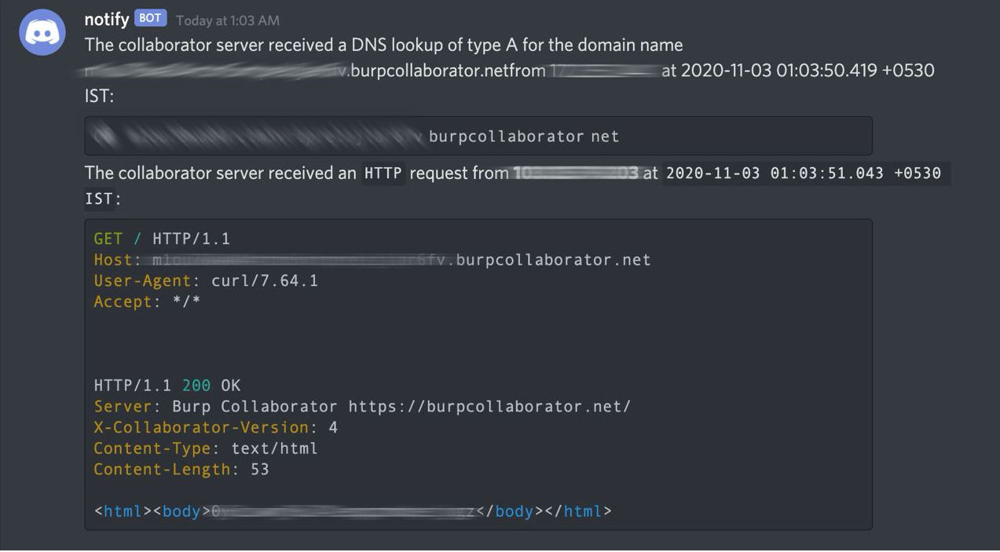

<h1 align="left">
  </a>
  <br>
</h1>


[](https://opensource.org/licenses/MIT)
[](https://goreportcard.com/report/github.com/projectdiscovery/notify)
[](https://github.com/projectdiscovery/notify/issues)
[](https://github.com/projectdiscovery/notify/releases)
[](https://twitter.com/pdiscoveryio)
[](https://discord.gg/KECAGdH)

Notify is an helper utility written in Go that allows you to pull results from burp collaborator instances and post to CLI, also sends the notification via webhooks to Slack and Discord.

# Resources
- [Resources](#resources)
- [Features](#features)
- [Usage](#usage)
- [Installation Instructions](#installation-instructions)
    - [From Binary](#from-binary)
    - [From Source](#from-source)
    - [From Github](#from-github)
- [Intercept BIID](#intercept-biid)
- [Config File](#config-file)
- [Running notify](#running-notify)
  - [CLI](#cli)
  - [Slack notification](#slack-notification)
  - [Discord notification](#discord-notification)
  - [General purpose use](#using-notify-with-other-tools)

# Features

<h1 align="left">
  </a>
  <br>
</h1>

- 💥 Automatic Burp Collaborator BIID interception.
- 💥 Burp Collaborator Slack / Discord notification support.
- 💥 Redirect output of any tool to Slack / Discord / Telegram. 

# Usage

```sh
▶ notify -h
```

This will display help for the tool. Here are all the switches it supports.

| Flag | Description | Example |
|------|-------------|---------|
| -biid	| burp private key	| notify -biid 123456789	|
| -slack-webhook-url 	| Slack Webhook URL | notify -slack-webhook-url hxxp://a.b.c |
| -slack-username	| Slack Username | notify -slack-username test |
| -slack-channel	| Slack Channel | notify -slack-channel test |
| -slack	| Enable Slack | notify -slack |
| -discord-webhook-url 	| Discord Webhook URL | notify -discord-webhook-url hxxp://a.b.c |
| -discord-username	| Discord Username | notify -discord-username test |
| -discord-avatar	| Discord Avatar Url | notify -discord-avatar hxxp://a.b.c |
| -discord	| Enable Discord | notify -discord |
| -silent 	| Silent mode | notify -silent |
| -version 	| Show version of notify | notify -version |
| -interval 	| Polling interval in seconds | notify -interval 5 |
| -intercept-biid 	| Attempt to intercept biid (needs sudo) | notify -intercept-biid |
| -intercept-biid-timeout 	| Timeout for biid interception in seconds | notify -intercept-biid-timeout 120 |
| -http-message 	| HTTP Message | notify -http-message test |
| -dns-message 	| DNS Message | notify -dns-message test |

# Installation Instructions

### From Binary

The installation is easy. You can download the pre-built binaries for your platform from the [releases](https://github.com/projectdiscovery/notify/releases/) page. Extract them using tar, move it to your `$PATH`and you're ready to go.

```sh
Download latest binary from https://github.com/projectdiscovery/notify/releases

▶ tar -xvf notify-linux-amd64.tar
▶ mv notify-linux-amd64 /usr/local/bin/notify
▶ notify -version
```

### From Source

Notify requires **go1.14+** to install successfully. Run the following command to get the repo -

Installing Notify -

```sh
▶ GO111MODULE=on go get -u -v github.com/projectdiscovery/notify/cmd/notify
```

Installing Intercept - 

```sh
▶ GO111MODULE=on go get -u -v github.com/projectdiscovery/notify/cmd/intercept
```

### From Github

Installing Notify -

```sh
▶ git clone https://github.com/projectdiscovery/notify.git; cd notify/cmd/notify; go build; mv notify /usr/local/bin/; notify -version
```

Installing Intercept - 

```sh
▶ git clone https://github.com/projectdiscovery/notify.git; cd notify/cmd/intercept; go build; mv intercept /usr/local/bin/;
```

# Intercept BIID

- Run intercept as root `sudo intercept`
- Open Burp Suite => Project Options => Misc
- Tick `Pull Over HTTP`
- Generate **new** collaborator, click on **Poll now**. 
- Intercept will capture `biid` that can be used with `notify`

```sh
sudo ./intercept
Attempting to intercept BIID
BIID found: o%2JREfoFxWfdk4i1VOvPQiX96MfpZ7qlZ6kXiGeHbjvJ%3d
```

# Running notify

## CLI

You can use **notify** to receive burp collaborator interaction on your CLI, following command accepts `biid` as input and post all incoming interaction over CLI.

```sh
notify -biid 132456789                                  
```

## Slack notification

The tool accept parameters from a config file located at `$HOME/.config/notify/notify.conf` or either via CLI. 

To run the tool just use the following command.

```sh
▶ notify -biid 132456789 -slack -slack-webhook-url https://a.b.c -slack-username test -slack-channel test-channel
```

If you already configured the config file, you can simply run following command and `notify` will start receiving burp collaborator interaction on CLI and sends notification to slack / discord. 

```sh
▶ notify
```

## Discord notification

Similarly to slack, in order to use discord

```sh
▶ notify -biid 132456789 -discord -discord-webhook-url https://a.b.c -discord-username notify-bot
```

## Telegram notification

Similarly to slack, in order to use discord

```sh
▶ notify -biid 132456789 -telegram -telegram-api-key 119489xxxx-:AAF4OV9 -telegram-chat-id 1231434
```

## Using notify with other tools

Notify also supports piping output of any tool and send it over discord/slack channel as notification.

Following command will enumerate subdomains using [SubFinder](https://github.com/projectdiscovery/subfinder) and probe for alive URLs and sends the notifications of alive URLs using [httpx](https://github.com/projectdiscovery/httpx) to configured discord / slack channel.

```
subfinder -d hackerone.com | httpx | notify
```

<h1 align="left">
  </a>
  <br>
</h1>

Following command will enumerate subdomains using [SubFinder](https://github.com/projectdiscovery/subfinder) and probe alive URLs using [httpx](https://github.com/projectdiscovery/httpx), runs [Nuclei](https://github.com/projectdiscovery/nuclei) templates and send the nuclei results as a notifications to configured discord / slack channel.


```
subfinder -d intigriti.com | httpx | nuclei -t files | notify
```

In similar manner, output (stdout) of any tool can be piped to **notify** for posting data into slack/discord.

# Config File
The default config file should be located in `$HOME/.config/notify/notify.conf` and has the following contents:

```yaml
burp_biid: 132465789
# Slack
slack: true
slack_webhook_url: https://a.b.c
slack_username: test
slack_channel: test

# Discord
discord: true
discord_webhook_url: https://a.b.c
discord_username: test
discord_avatar: https://a.b.c/avatar

# Telegram
telegram: true
telegram_apikey: 119489xxxx-:AAF4OV9cdCEzq3tQ3aMtVyzHaRV3a1M7Ow4
telegram_chat_id: 36808xxxx

# General Settings
interval: 2 # seconds

http_message: |
    The collaborator server received an {{protocol}} request from {{from}} at {{time}}:

    ```http
    {{request}}

    {{response}}
    ```

dns_message: |
    The collaborator server received a DNS lookup of type {{type}} for the domain name {{domain}} from {{from}} at {{time}}:

    ```
    {{request}}
    ```
``` 


📋 Notes

- You can obtain the **biid** with wireshark on any platform and configure it within the config file.
- Burp collaborator server allow to fetch results only for once, so if you are using this, you will **not** see results in burp collaborator window.
- Config file has priority over CLI arguments.
- Telegram notifcation does not support burp collaborator.

## References:- 

- [Creating Slack webhook](https://slack.com/intl/en-it/help/articles/115005265063-Incoming-webhooks-for-Slack)
- [Creating Discord webhook](https://support.discord.com/hc/en-us/articles/228383668-Intro-to-Webhooks)
- [Creating Telegram bot](https://core.telegram.org/bots#3-how-do-i-create-a-bot)

Notify is made with 🖤 by the [projectdiscovery](https://projectdiscovery.io) team.
